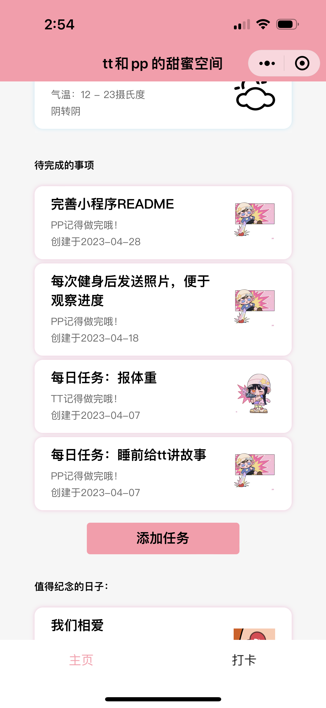
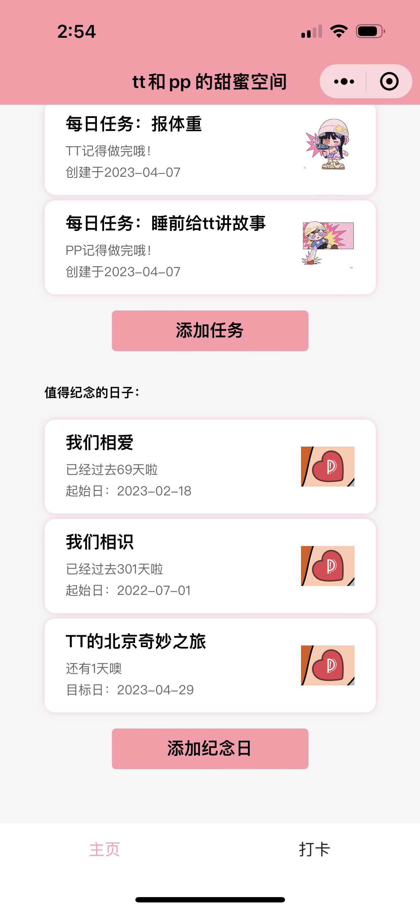
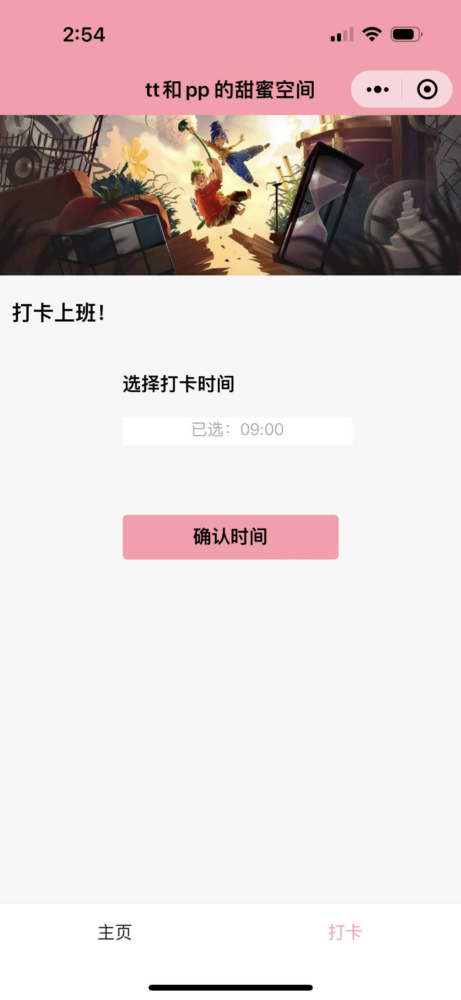
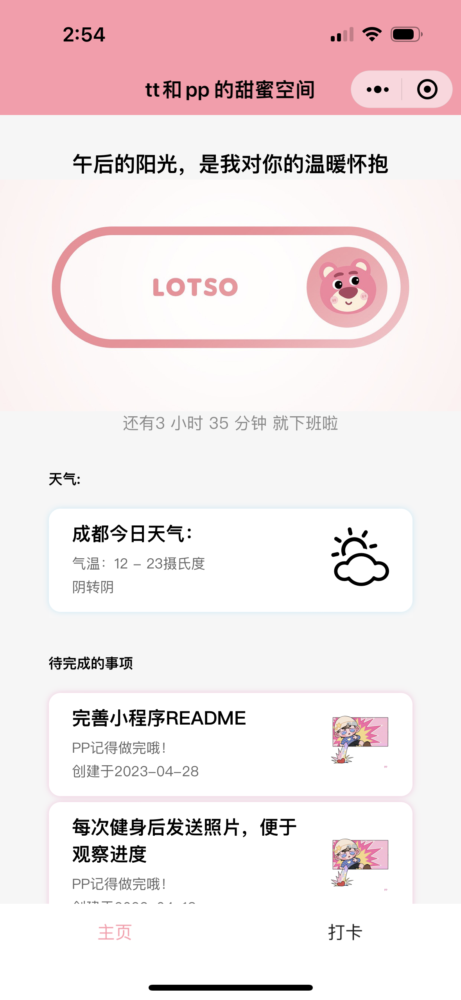

# WeChat-MiniProgram-PP&TT-SweetSpace

## Overview

This is a personal project that creates a Wechat Mini program that provides a platform to interact with my partner. This platform allows both of us to keep track of our to-do lists and memorable days, as well as displaying weather info and a countdown towards the end of her shift. 
  
## About Wechat Mini Programs
Wechat Mini Programs are 'sub-applications' that are embedded within one of most popular Chinese social media Wechat. They enable users to have fast and convenient access to third-party services without having to download the app on their systems. The program mainly uses Javascript, WXML

The development framework of the WeChat Mini Program is based on the MINA framework. It  mainly includes app.json, app.js, and app.wxss. app.json is the global configuration of the entire applet. index.js is the logic processing code, which is mainly used to define the data of the page; index.wxml is
the layout file, which is a variation of HTML for display; Index.wxss is a style
sheet that is also a slight variation of CSS[1]. 
  
## Core Functionalities

### Reminders
Users can create reminders that consist a title, and the person that is assigned to the task. The icon of the reminder display will change depending the person assigned to it. 

Each horizontal bar represents a reminder, and the cartoon icon corresponds to our Wechat profile pictures.
  
### Memorable days
Users can create memorable days that consist a title, the date of the event. The home page will display the event in a horizontal bar format similar to reminders and will also display the days elapsed since the event or remaining days until the event. 

  
### Clock on and countdown
She has a fixed 9.5 hours shift on weekdays. She can choose the time that she clocked on and a countdown towards her end of shift will display on the home page, right under the Lotso image. 

  
### Greeting messages and weather
The greeting messages on the top of the home page will change based on the time of the day. Under the countdown message is the weather of the city she lives in. The weather info is fetched by calling a remote API hosted by a third party weather info provider. 

  

## Update logs
### V1.0.0
Included initial functionalities. 

### V1.0.1
Added the clock on and countdown feature and changed the reminder display order. 

  

## Future Improvements
- Consider using components instead of new pages for reminders/memorable days as a lot of code are redundant. I was new to Wechat mini program development and I didn't realise I could generalise similiar objects as components as in React JS. 
- Consider using dynamic table names when calling backend databases, instead of creating new cloud functions for every database table. Cloud functions are hard to modify as it would take time to upload and deploy remotely. Simply pass the table name as a variable will do the job. 
- She is UI designer and she has suggested a better design that incorporates more elements that reflect our relationship
  

## Acknowledgements
This project is inspired by Junyi Han (UxxHans on github),
Rainbow-Cats-Personal-WeChat-MiniProgram, availabe at: https://github.com/UxxHans/Rainbow-Cats-Personal-WeChat-MiniProgram  

With special thanks to Roy Gao for providing Mini Program developer account. Most importantly, thanks for her continous support and love. 

  
## References 
[1] Hao, L., Wan, F., Ma, N. & Wang, Y. (2018). Analysis of the Development of WeChat Mini Program. Journal of Physics: Conf. Ser. 1087 062040. https://iopscience.iop.org/article/10.1088/1742-6596/1087/6/062040/pdf#:~:text=The%20development%20framework%20of%20the,framework%20based%20on%20Java%20technology.
   

NOTE: below is a Chinese version of the README
  

## 概览

这是一个微信小程序个人项目，旨在为我和我女朋友之间提供一个交流的平台。这个平台提供了待办事项和纪念日，以及一些天气还有下班倒计时的功能
  

## 主要功能

### 待办事项

用户可以创建任务，包括标题，以及谁应该去完成，旁边的图标会根据完成的人改变

每个横向的条代表一个任务，图标对应的是我们的微信头像
  
### 纪念日
用户可以创建纪念日，包括标题，事件发生的日期。主页会以和待办事项相似的方式展示，而且会显示已经过去的时间，或者到那一天的倒计时

  
### 打卡上班和倒计时
她上班的固定时间是9个半小时，她能选定她打卡上班的时间，然后在主页草莓熊图片的下方会显示倒计时到下班。

  
### 问候语和天气
主页最上方的问候语会根据一天的时间改变，下方也会展示成都的天气。天气信息由第三方服务和风天气提供，调用了他们的天气API

  

## 更新日志
### V1.0.0
发布了主要功能

### V1.0.1
增加了打卡和倒计时功能，并改变了任务的显示顺序

  

## 一些改进
- 考虑使用components，而不是创建新页面，很多代码可以反复使用，现在有点重复。我第一次开发小程序不是很熟悉，其实可以像React一样用components然后通过初始参数去构造

- 考虑调用后端数据库的时候使用动态的数据库表名，而不是每一个表都重新创建一个云函数去调。云函数比较难调试而且需要花时间上传和部署。把表的名字当成变量名传进去就好了
- 她是UI设计师，她已经画了个超级好看的设计图，包含了更多体现我们感情的元素，有空再改 （现在她是我的产品经理
  

## 鸣谢

这个项目深受Junyi Han (github用户名UxxHans)启发，rainbow-Cats-Personal-WeChat-MiniProgram, availabe at: https://github.com/UxxHans/Rainbow-Cats-Personal-WeChat-MiniProgram 
也感谢Roy Gao帮助我创建小程序开发账号。最重要的是，感谢她一直以来的陪伴和支持。

  
## 参考文献
[1] Hao, L., Wan, F., Ma, N. & Wang, Y. (2018). Analysis of the Development of WeChat Mini Program. Journal of Physics: Conf. Ser. 1087 062040. https://iopscience.iop.org/article/10.1088/1742-6596/1087/6/062040/pdf#:~:text=The%20development%20framework%20of%20the,framework%20based%20on%20Java%20technology.

